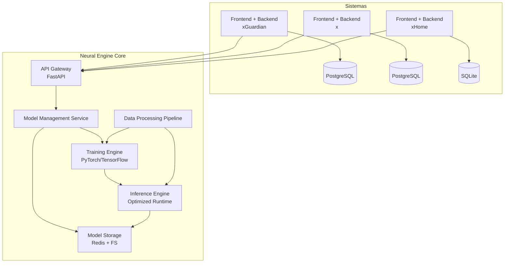

# 🚀 Neural Engine Core – Portfolio Architecture

Este repositorio forma parte de mi **portafolio personal**.  
Presenta el **Neural Engine Core**: un motor unificado de Machine Learning multi-sistema ya implementado, que se integra con plataformas de ciberseguridad, gestión de tareas empresariales y productividad doméstica.

---

## 📘 Documento principal

📄 [Neural_Engine_Core_Portfolio.md](Neural_Engine_Core_Portfolio.md)

El documento describe:
- Principios de diseño modular y escalable.
- Arquitectura basada en microservicios y FastAPI.
- Entrenamiento y despliegue de modelos de ML con PyTorch/TensorFlow.
- Pipelines de datos, feature store y validación.
- Estrategias de escalabilidad, optimización de recursos y monitoreo.
- Ejemplos de integración multi-sistema (xGuardian, x, xHome).

---

## 🏗️ Arquitectura General

---

## 🚀 Estado actual

- **Neural Engine Core** implementado en **FastAPI**.  
- Integraciones con sistemas tipo **xGuardian, x y xHome**.  
- Pipelines de datos con feature store centralizado.  
- Entrenamiento de modelos con **PyTorch/TensorFlow**.  
- **Inferencia en producción** con optimización de latencia.  
- Arquitectura **multi-tenant aislada** para independencia de datos.  

---

## 🔭 Futuro y mejoras

- Optimizar pipelines de datos (performance y costos).  
- Ampliar set de modelos soportados (ej. RL, embeddings semánticos).  
- Más integraciones con sistemas externos (APIs de terceros, IoT, etc.).  
- Dashboards de monitoreo y métricas en tiempo real más avanzados.  

---

## 🧩 Tecnologías

- **Backend / APIs** → FastAPI  
- **ML / Training** → PyTorch, TensorFlow  
- **Storage** → PostgreSQL, Redis, FileSystem  
- **Infraestructura** → Docker, Kubernetes (futuro)  
- **Monitoreo** → Prometheus + Grafana  

---

## 📬 Contacto

👤 **Alejandro Agustin Seiler** – Python & React Developer Trainee  
🌐 [LinkedIn](https://www.linkedin.com/in/alejandroseiler/) | [GitHub](https://github.com/AlejandroASeiler) | [Email](agustinseiler@outlook.com)

---

> ⚠️ **Nota:** Este proyecto forma parte de un **portafolio personal**.  
> El documento y el README están adaptados para uso público, sin exponer información sensible de negocio ni seguridad.
