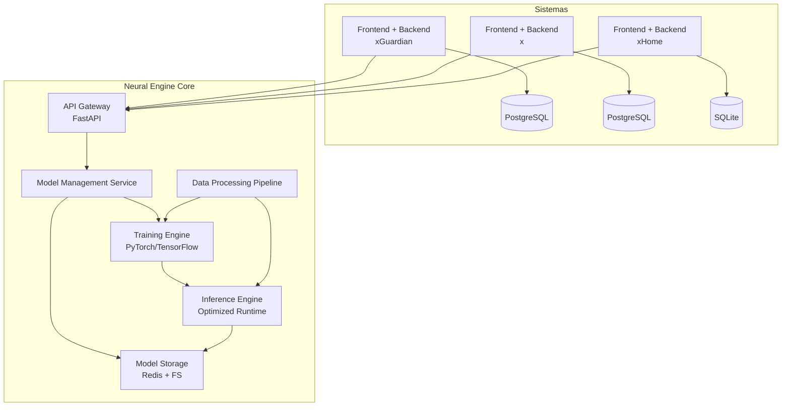

# 🚀 Neural Engine Core – Portfolio Architecture

Este repositorio forma parte de mi **portafolio personal**.  
Incluye el diseño arquitectónico de un **Neural Engine Core** unificado que puede servir como **motor de Machine Learning multi-sistema**, integrándose con plataformas de ciberseguridad, gestión de tareas empresariales y productividad doméstica.

---

## 📘 Documento principal

📄 [Neural_Engine_Core_Portfolio.md](Neural_Engine_Core_Portfolio.md)

El documento describe:
- Principios de diseño modular y escalable.
- Arquitectura basada en microservicios y FastAPI.
- Entrenamiento y despliegue de modelos de ML con PyTorch/TensorFlow.
- Pipelines de datos, feature store y validación.
- Estrategias de escalabilidad, optimización de recursos y monitoreo.
- Próximos pasos para convertir el diseño en un sistema productivo.

---

## 🏗️ Arquitectura General

---

## 🎯 Objetivo del proyecto

Diseñar un **engine centralizado de ML** que:
- Permita a múltiples sistemas cliente **compartir infraestructura** sin perder independencia de datos.  
- Asegure **aislamiento multi-tenant** y escalabilidad horizontal.  
- Soporte diferentes tipos de modelos (anomalías, predicción, recomendación, NLP).  
- Facilite la evolución hacia producción en la nube.  

---

## 🧩 Tecnologías sugeridas

- **Backend / APIs** → FastAPI  
- **ML / Training** → PyTorch, TensorFlow  
- **Storage** → PostgreSQL, Redis, FileSystem  
- **Infraestructura** → Docker, Kubernetes (futuro)  
- **Monitoreo** → Prometheus + Grafana  

---

## 🚀 Próximos pasos

- Construcción de un **MVP** con FastAPI + PyTorch.  
- Implementación de un **pipeline de datos básico** para cada sistema cliente.  
- Integración con **sistema de autenticación y permisos**.  
- Despliegue en un entorno cloud con escalado automático.  

---

## 📬 Contacto

👤 **Alejandro Agustin Seiler** – Python & React Developer Trainee  
🌐 [LinkedIn](#https://www.linkedin.com/in/alejandroseiler/) | [GitHub](#https://github.com/AlejandroASeiler) | [Email](#agustinseiler@outlook.com)

---

> ⚠️ **Nota:** Este proyecto forma parte de un **portafolio personal**.  
> El documento está simplificado y adaptado para uso público, sin exponer información sensible de negocio ni seguridad.
